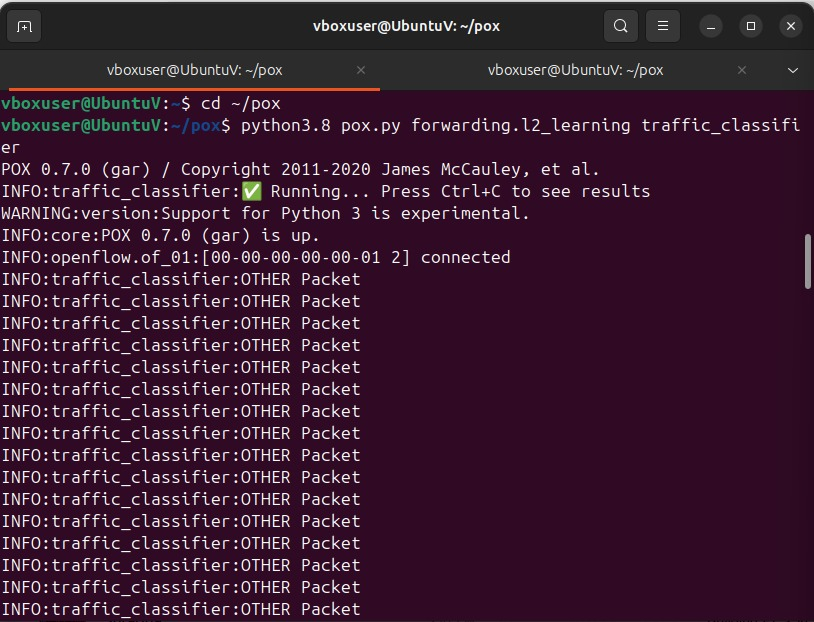
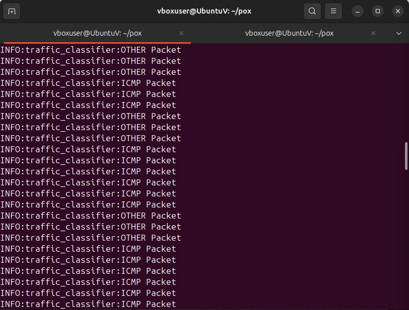
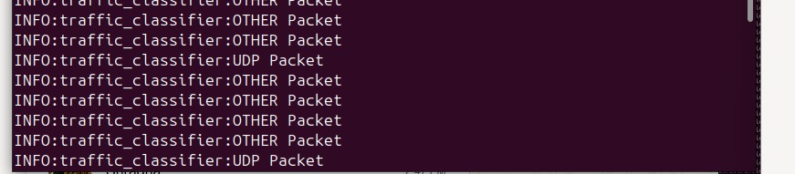
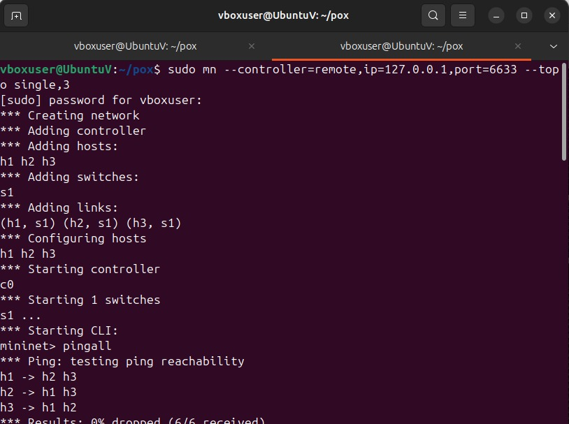
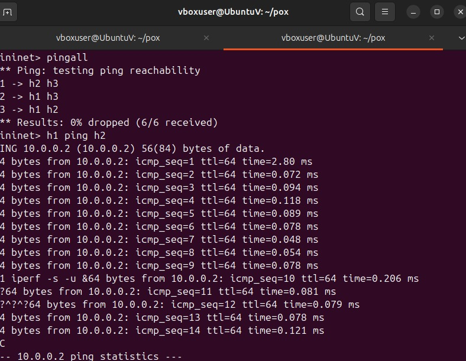
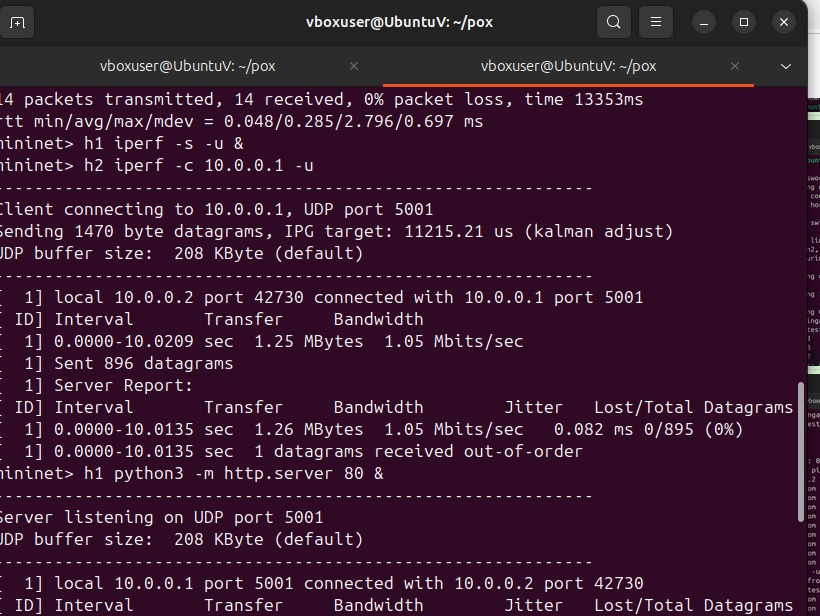
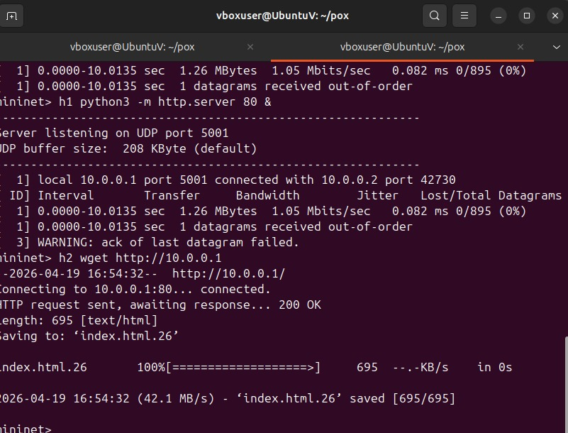

#  SDN Traffic Classification & Analysis (POX + Mininet)

##  Overview

This project implements a **Software Defined Networking (SDN)** based traffic monitoring system using the **POX controller** and **Mininet**.

The controller captures packets from the switch, classifies them into **TCP, UDP, ICMP, and Other**, and performs **traffic analysis before and after a traffic spike**.

---

##  Key Features

✔ Real-time packet classification
✔ Safe packet parsing (no POX crash issues)
✔ Traffic distribution analysis
✔ Before vs After spike comparison
✔ Supports ICMP (ping), UDP (iperf), TCP (HTTP)

---

##  System Architecture

* **Controller (POX)** → Decision making & analysis
* **Switch (OpenFlow)** → Forwards packets
* **Hosts (Mininet)** → Generate traffic

---

##  Working Flow

1. Mininet creates virtual network (h1, h2, h3, s1)
2. Switch sends packets to controller (**PacketIn**)
3. Controller:

   * Reads raw packet data
   * Identifies protocol (TCP/UDP/ICMP)
   * Updates counters
4. Traffic is divided into:

   * **Before Spike (normal traffic)**
   * **After Spike (iperf traffic)**
5. Final statistics are printed when program stops

---

##  Technologies Used

* Python
* POX Controller
* Mininet
* OpenFlow Protocol
* Ubuntu Linux

---

##  How to Run

### 1️ Clean Environment

```bash
sudo mn -c
pkill -f pox
```

### 2️ Start POX Controller

```bash
cd ~/pox
python3.8 pox.py your_file_name
```

### 3️ Start Mininet

```bash
sudo mn --controller=remote,ip=127.0.0.1,port=6633 --topo single,3
```

### 4️ Generate Traffic

#### ICMP Traffic

```bash
pingall
h1 ping h2
```

#### UDP Traffic (iperf)

```bash
h1 iperf -s -u &
h2 iperf -c 10.0.0.1 -u
```

#### TCP Traffic (HTTP)

```bash
h1 python3 -m http.server 80 &
h2 wget http://10.0.0.1
```

---

### 5️ View Final Analysis

Press:

```bash
Ctrl + C
```

---

##  Sample Output

```
=========== BEFORE SPIKE ==========
TYPE     TOTAL     PERCENT     AVG PPS
TCP      0         0.00%       0.00
UDP      0         0.00%       0.00
ICMP     18        36.00%      0.46
OTHER    32        64.00%      0.82

=========== AFTER SPIKE ==========
TCP      12        23.08%      0.06
UDP      4         7.69%       0.02
ICMP     6         11.53%      ...
OTHER    ...
```

---

##  Packet Classification Logic

| Protocol | Identification       |
| -------- | -------------------- |
| ICMP     | Protocol number = 1  |
| TCP      | Protocol number = 6  |
| UDP      | Protocol number = 17 |
| Other    | Non-IP / ARP packets |

---

##  Analysis Metrics

* Total packets
* Protocol distribution (%)
* Average packets per second (PPS)
* Before vs After traffic comparison

---

##  Important Notes

* Many packets appear as **OTHER** due to ARP (non-IP packets)
* ICMP → generated by `ping`
* UDP → generated by `iperf`
* TCP → generated by HTTP server

---
## Proof of Execution

### 🔹 Controller Side (POX)
 POX Controller Startup and Initial Packet Monitoring
 
```
ICMP Packet Classification by POX Controller
 
```
UDP Packet Detection using iperf Traffic
 
 ```
TCP Packet Detection and Final Traffic Analysis (Before vs After Spike)
  


### 🔹 Traffic Generator Side (Mininet CLI)
 
 
 
 


